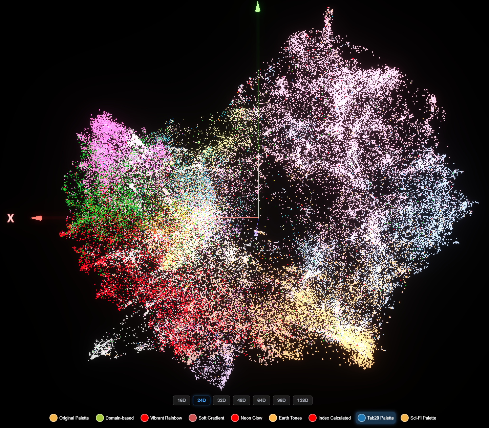
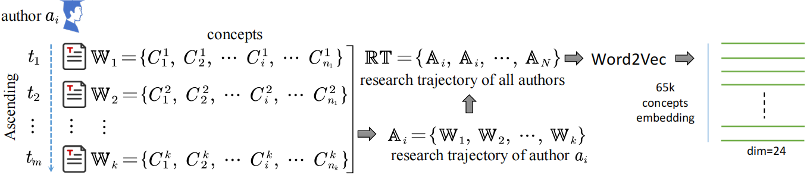
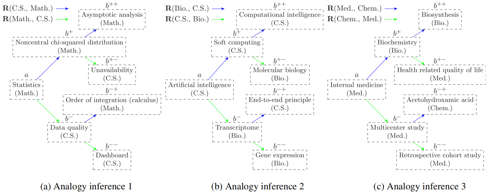

# SciConNav: Knowledge Navigation through Contextual Learning of Extensive Scientific Research Trajectories

An embedding-based navigation system using extensive scientific research trajectories to explore semantic relationships and knowledge pathways between scientific concepts.

[


## Project Overview

SciConNav (Scientific Concept Navigator) is a novel approach to scientific knowledge navigation that leverages extensive research trajectories from millions of scholars. The system learns concept representations through contextual learning, enabling users to explore semantic relationships, identify interdisciplinary pathways, and discover knowledge connections across 19 academic disciplines. The system offers a 3D visualization interface for interactive exploration of the scientific knowledge space.


*SciConNav concept embedding visualization showing the spatial distribution of 64,976 scientific concepts across 19 disciplines, with clear clustering patterns for mono-disciplinary concepts and broader distribution for multi-disciplinary concepts.*

### Key Features

- **Multi-dimensional Visualization**: Supports Word2Vec models from 16 to 128 dimensions, with optimal performance at 24 dimensions, providing 3D and 2D view switching
- **Interactive Exploration**: Supports searching, filtering, and focusing on specific concepts
- **Interdisciplinary Navigation**: Identifies the shortest semantic pathways between concepts, revealing knowledge inheritance and dependency relationships
- **Discipline Classification**: Categorizes concepts into Mono-disciplinary and Multi-disciplinary types using LLM-based annotation across 19 major disciplines
- **Analogical Reasoning**: Enables multi-step analogy inference between concepts from various disciplines through vector arithmetic
- **Global Knowledge Network**: Constructs a fully connected network of 20,000 representative concepts with shortest path algorithms
- **Real-time Rendering**: Uses Three.js for high-performance 3D rendering with zoom, rotation, and pan capabilities

## Technical Architecture


*Figure 1: Concept representation learning from extensive research trajectories*

SciConNav employs a comprehensive pipeline from OpenAlex data processing to interactive 3D visualization:

### Data Processing
- **Dataset**: 1,332,254 authors (50+ publications), 70,600,299 works, 64,976 concepts across 19 disciplines
- **Research Trajectories**: Time-ordered concept sequences encoding prerequisite relationships
- **LLM Annotation**: Five state-of-the-art LLMs achieve 100% discipline coverage vs 75.83% tree-structure methods
- **Concept Classification**: Mono-disciplinary (68.35%) and Multi-disciplinary (31.65%) categories

### Core Learning Pipeline
- **Word2Vec Training**: 24-dimensional embeddings from research trajectories, optimized through IDP/CDP analysis
- **UMAP Reduction**: Preserves local and global structures for 3D/2D visualization
- **Binary Format**: Custom multi_dim_binary_v2 for efficient data storage

### Knowledge Navigation Algorithms

#### Analogical Reasoning Implementation


*Figure 5: Cross-disciplinary analogy inference examples*

- **Vector Arithmetic**: b^± = argmax_b {sim(b̄, ā ± R(c̄,d̄))} for concept derivation
- **Multi-step Reasoning**: Positive/negative relation exploration across disciplines
- **Applications**: Mathematics↔Computer Science, Computer Science↔Biology, Chemistry↔Medicine

#### Centrality Analysis


*Figure 8: High-centrality concepts bridging cross-domain knowledge paths*

- **Network Analysis**: Top 20,000 concepts with Weighted Shortest Path (WSP) algorithm
- **Bridge Validation**: H concepts appear 46.97% in Cross-Domain vs 37.86% In-Domain paths
- **Multi-disciplinary Bridge**: 38.16% vs 23.18% bridge rates in Cross-Domain vs In-Domain paths

#### Global Knowledge Connectivity
- **Path Efficiency**: 99% of concept pairs connectable within 6 steps
- **Accessibility**: Quantified semantic distances between disciplines

### Interactive 3D Visualization
- **Frontend**: Three.js-powered rendering with InstancedMesh optimization
- **Features**: Real-time filtering, dimension switching (16D-128D), discipline highlighting
- **Controls**: Zoom, rotation, pan, auto-rotation, axis display
- **Performance**: UnrealBloomPass post-processing for enhanced visual appeal

## Quick Start

### 3D Visualization

**Open in browser**:
   Visit https://xianshb.github.io/SciConNav

### Data Processing

#### Generate Multi-dimensional Data

```bash
# Process all Word2Vec model dimensions and generate binary data
python process_word2vec_to_3d_all.py \
  --models_dir models/ \
  --csv data/All_concepts_with_ancestors_llm_annotation.csv \
  --output data/concept_coordinates.bin
```

#### Generate Metadata

```bash
# Generate concept metadata
python generate_metadata_json.py \
  --model models/Word2Vec_dim_128_epoch_100.model \
  --csv data/All_concepts_with_ancestors_llm_annotation.csv \
  --output data/concept_coordinates_meta.json
```

#### Inspect Coordinates

```bash
# Check generated coordinate data
python inspect_coordinates.py
```

## Visualization Features

### Main Interactive Functions

1. **Search Concepts**: Enter concept names in the search box to quickly locate and focus on specific concepts
2. **Dimension Switching**: Click dimension buttons at the bottom (16D, 24D, 32D, 48D, 64D, 96D, 128D)
3. **View Switching**: Switch between 3D and 2D views, with 2D view disabling rotation
4. **Discipline Filtering**: Select/deselect specific disciplines through the right panel
5. **Level Filtering**: Filter display by concept depth level (0-5)
6. **Color Schemes**: Choose different color schemes to distinguish disciplines
7. **Auto Rotation**: Toggle auto-rotation on/off
8. **Axis Display**: Show axes with arrows (X, Y, Z) to help understand 3D space

### Navigation Controls

- **Mouse Wheel**: Zoom view
- **Left Drag**: Rotate perspective
- **Ctrl + Left Drag**: Pan view
- **Right Click**: Display concept details

## Data Formats

### Binary Data Format

The project uses a custom multi-dimensional binary format (multi_dim_binary_v2):

```
Header (8 bytes):
- n_points (uint32): Number of concepts
- n_dims (uint32): Number of dimensions
- [dim_val] (uint32) * n_dims: Dimension values

Data Body (20 bytes + 20*n_dims bytes per point):
- discipline_id (uint32): Discipline ID
- level (uint32): Concept level
- [Coordinates for each dimension]:
  - 3D: x3 (float32), y3 (float32), z3 (float32)
  - 2D: x2 (float32), y2 (float32)
```

### Metadata Format

```json
{
  "n_points": 64976,
  "n_disciplines": 19,
  "discipline_names": ["Art", "Biology", ...],
  "concept_names": ["Concept1", "Concept2", ...],
  "available_dimensions": [16, 24, 32, 48, 64, 96, 128],
  "format": "multi_dim_binary_v2"
}
```

## Scientific Contributions

Findings based on the SciConNav system:

1. **Concept Analogy Reasoning**: Multi-step analogy reasoning between interdisciplinary concepts through vector operations
2. **Knowledge Navigation Pathways**: Identifying shortest semantic pathways between concepts, revealing knowledge dependencies
3. **Interdisciplinary Bridges**: Identifying interdisciplinary concepts that play key roles in knowledge networks
4. **Functional Dimension Analysis**: Analyzing functional attributes of knowledge through predefined conceptual axes

### Major Findings

- **High Knowledge Connectivity**: 99% of concept pairs connectable within 6 steps, indicating a highly interconnected knowledge structure
- **Bridge Concepts Validation**: High-centrality concepts appear 46.97% in Cross-Domain paths vs 37.86% In-Domain paths, confirming their critical bridging role in interdisciplinary connections
- **Efficient Navigation**: Shortest path distances are consistently shorter than direct distances (e.g., Pure Math→Bioinformatics: 0.99 vs 1.38), enabling effective knowledge navigation
- **Disciplinary Clustering**: Clear spatial clustering of Mono-disciplinary concepts vs broader dispersion of Multi-disciplinary concepts

## 19 Academic Disciplines

The system covers 19 root-level academic disciplines organized into 8 functional groups:

| Functional Group | Disciplines | Functional Group | Disciplines |
|------------------|-------------|------------------|-------------|
| Theoretical | Mathematics, Physics | Societal | Sociology, Political science, Psychology |
| Applied | Computer science, Engineering | Economic | Economics, Business |
| Chemical | Chemistry, Materials science | Humanities | Philosophy, History, Art |
| Biomedical | Biology, Medicine | Geographical | Geography, Geology, Environmental science |

## Performance Optimization

1. **Binary Data Format**: Optimizes loading performance for large datasets
2. **Instanced Rendering**: Reduces draw calls, improving rendering efficiency
3. **LOD System**: Supports multi-level detail, adjusting rendering precision based on distance
4. **Memory Management**: Efficient data structures and buffer management

## Extensibility

The system design supports the following extensions:

1. **Adding New Dimensions**: Easily add new Word2Vec model dimensions
2. **Custom Color Schemes**: Add new color schemes through JSON configuration
3. **Plugin System**: Modular design supports feature extensions
4. **API Integration**: Can integrate external knowledge graph APIs

## Citation

If you use the SciConNav system or data in your research, please cite the following paper:

```
@article{xiang2025sciconnav,
  title={SciConNav: Knowledge navigation through contextual learning of extensive scientific research trajectories},
  author={Xiang, Shibing and Jiang, Xin and Liu, Bing and Huang, Yurui and Tian, Chaolin and Ma, Yifang},
  journal={Journal of the Association for Information Science and Technology},
  year={2025},
  publisher={Wiley Online Library}
}
```
